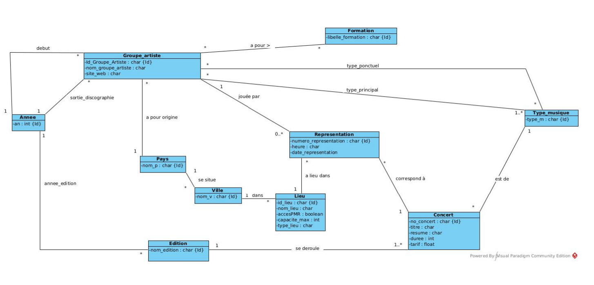

# SAE 104 Création d'une base de données

Ce projets avais pour but l'implementation en modele relationnel SQL d'un diagrame de classe UML

Cependant cette implementation est incomplete car j'étais debutant dans l'exercice

# Diagrame UML source :

</div

## Auteur

- [@MrIdez](https://www.github.com/MrIdez)
